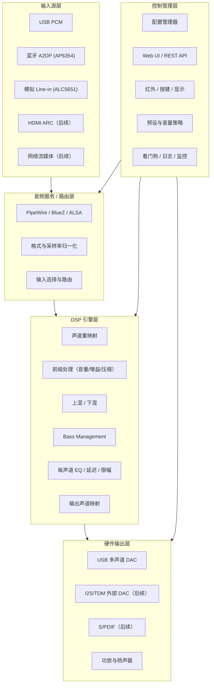
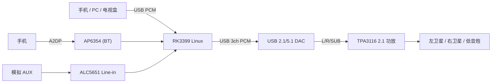

# 系统架构详细设计

> 状态：草稿（V1 评审稿）  
> 目标分支：`theater_2.1_V1.0`  
> 适用范围：家庭音响系统的软件架构、模块划分、部署形态与升级路径

## 1. 文档目的

本文描述 mini-theater-speaker 的整体软件架构，明确各层职责和接口边界，使系统能够：

- 在 RK3399 上以最低成本完成 2.1 声道全链路验证；
- 后续平滑升级到 5.1 / 7.1 / 7.1.4，而不重写 DSP 和路由逻辑；
- 在更换主控 SoC（如 RK3588、Amlogic、Allwinner 等）时，应用层和音频管线基本不动。

## 2. 设计原则

| 原则 | 说明 |
| --- | --- |
| 声道拓扑与硬件解耦 | 逻辑声道（FL/FR/LFE...）与物理 DAC 通道映射分离，配置驱动 |
| 引擎无关 | 管线定义不绑定 CamillaDSP，未来可替换为其它 DSP 引擎 |
| 目标声道数预留 | 管线按最大 8 声道（后续 16 声道）建模，2.1 只是其中一个 profile |
| 输入源可插拔 | USB PCM、蓝牙 A2DP、模拟输入、HDMI ARC、网络流媒体通过统一路由层接入 |
| 配置即产品 | 所有调音参数、输入输出映射、预设都落在配置文件，代码不含硬编码声道 |
| 可测量 | 每个阶段都有明确的信号定义、测试音和验收指标 |

## 3. 总体架构

## 4. 模块划分

### 4.0 操作系统层

- 推荐 **Ubuntu 24.04 LTS（arm64）rootfs + 厂商 BSP 内核**（Debian 同源备选）；
- 音频栈（ALSA/PipeWire/BlueZ）、Python、Web 组件用 apt 管理，迭代最快；
- 内核与驱动保持厂商 SDK 基线，避免上游内核破坏 ALC5651/AP6354 支持；
- 当前 eMMC 上的 Android 8 保留，开发阶段从 SD 卡启动 Ubuntu（双系统过渡）；
- Android 不作为运行底座，但其开发环境可用于 BSP 编译和未来手机遥控 App；
- 详细对比见 `docs/linux_os_selection.md`。

### 4.1 输入源适配层

| 输入源 | 接口 | V1 状态 | 说明 |
| --- | --- | --- | --- |
| USB PCM | USB Audio Class | 支持（软件验证） | 手机/电脑/电视盒通过 USB 输出 PCM，可做 2.0/2.1/5.1 通道 |
| 蓝牙 A2DP | AP6354 + BlueZ | 支持 | 手机推送音乐；V1 使用 SBC/AAC，后续评估 LDAC/aptX 硬件 |
| 模拟 Line-in | ALC5651 ADC + I2S1 | 支持 | 作为模拟 AUX 输入；后续可做音源自动检测 |
| HDMI ARC/eARC | 需 HDMI RX 子卡 | 后续 | RK3399 原生只有 HDMI TX，需要额外 HDMI RX/ARC 芯片 |
| 网络流媒体 | 以太网/WiFi | 后续 | AirPlay、UPnP、Spotify Connect、DLNA |

输入适配层对外输出统一的 PCM 语义：采样率统一为 48kHz、声道布局用逻辑声道名描述、边界格式按设备能力选择。

### 4.2 音频服务与路由层

- **PipeWire** 负责聚合多个输入源（蓝牙、ALSA、应用播放），并将它们路由到 DSP 的输入端。
- V1 为降低延迟和复杂度，USB/文件/管线测试可让 CamillaDSP 直接读写 ALSA/文件设备；蓝牙等异步源先经 PipeWire 输出到 ALSA loopback，再被 CamillaDSP 采集。
- 采样率归一化在 PipeWire（源侧）或 ALSA 插件完成，DSP 统一在 48kHz 下处理。

### 4.3 DSP 引擎层

- 采用 CamillaDSP 作为 V1 引擎，单实例、多声道（配置按 8 声道预留）。
- 所有 DSP 参数（分频点、EQ、延迟、增益、限幅）来自 profile 配置，不写死在代码中。
- 当前 `configs/2.1*.yml` 是引擎层配置；产品层还应维护一份更高抽象的 profile（见 `docs/config_spec.md`），由配置管理器生成引擎配置。

### 4.4 硬件输出层

- V1 输出走 USB 3 声道 DAC（L/R/SUB），再接 TPA3116 2.1 功放。
- RK3399 原生 I2S0 支持 8 声道 TDM，为 5.1/7.1 预留；ALC5651 只有 2 个模拟 DAC，因此不作为 2.1 主输出，但可用于模拟输入、耳机监听和 SPDIF/辅助输出。
- 后续可用 I2S0 + TDM 外接多声道 DAC，或继续使用 USB 多声道 DAC。

### 4.5 控制管理层

| 模块 | 职责 | V1 实现方式 |
| --- | --- | --- |
| 配置管理器 | 加载/校验 profile，生成 DSP 配置，热重载 | Python + YAML |
| Web UI | 音源选择、音量、预设、EQ 调节 | CamillaGUI 或自研轻量 Web |
| 本地交互 | 红外遥控、实体按键、LED 状态 | GPIO + 红外接收（RK3399 PWM3_IR） |
| 预设策略 | 音乐/电影/夜间/直通等场景 | profile 预设切换 |
| 监控 | 进程守护、DSP 运行状态、温度、功放保护 | systemd + 日志 |

## 5. V1 部署拓扑

## 6. 进程与服务模型（规划）

| 服务 | 作用 | 说明 |
| --- | --- | --- |
| `pipewire` / `wireplumber` | 音频服务与路由 | 蓝牙、应用音频入口 |
| `bluez` | 蓝牙协议栈 | A2DP sink |
| `camilladsp` | DSP 主引擎 | 由 systemd 管理，异常自动重启 |
| `theaterd` | 配置/控制守护进程（规划） | 监听配置变更、预设切换、Web API |
| `theater-monitor` | 健康监控（规划） | 温度、进程、功放保护、日志上报 |

## 7. 升级路径

| 阶段 | 声道 | 主要变化 |
| --- | --- | --- |
| V1 | 2.1 | USB 3ch DAC + TPA3116；验证管线与调音流程 |
| V1.5 | 2.1 | 完善控制层、预设、红外、开机时序与爆音抑制 |
| V2 | 5.1 | 6/8ch DAC + 5.1 功放；Bass Management 扩展到 5.1；HDMI ARC 输入 |
| V3 | 7.1 / 7.1.4 | 8ch（或 16ch）输出；更多输入源与空间声学处理 |
| 换芯 | 任意 | 更换 SoC 时仅替换驱动/内核层，应用与 DSP 管线保持不变 |

关键约束：任何新功能都不得破坏“逻辑声道 -> 物理通道”的配置化映射；新增声道只是新增 profile，而不是改代码。
