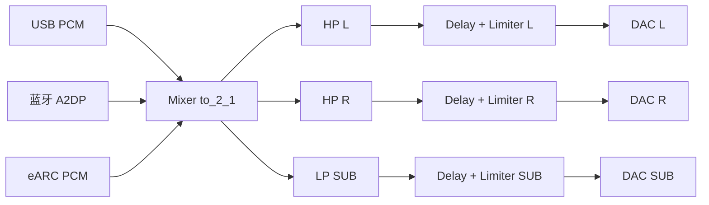

# 2.1 信号链设计

## 目标

用最低成本验证「立体声输入 -> DSP 低音管理 -> 三路输出」的完整软件链路。首版只处理 PCM，杜比 bitstream 解码由外部播放设备完成。

## 数据流

## 声道映射

| 输出通道 | 含义 | 输入来源 |
| --- | --- | --- |
| 0 | L 卫星 | 输入 L |
| 1 | R 卫星 | 输入 R |
| 2 | SUB 低音炮 | 输入 L + R |

## 默认 DSP 参数

| 参数 | 默认值 | 用途 |
| --- | --- | --- |
| 采样率 | 48000 Hz | 统一处理采样率 |
| 分频类型 | Linkwitz-Riley 4 阶 | 声学相位衔接更平滑 |
| 分频点 | 100 Hz | 后续按实际单元测量调整 |
| 延迟 | 0 ms | 用测量结果做物理延迟对齐 |
| 限幅 | -0.5 dBFS 软限幅 | 保护功放和单元 |

## 配置文件

- `configs/2.1.yml`：ALSA 回环设备，适合 Linux 无硬件验证。
- `configs/2.1.stdin.yml`：stdin/stdout，适合管道测试。
- `configs/2.1.file.yml`：读入生成的原始 PCM 文件并写出 3 声道文件，适合确定性回归。

所有配置共用同一套 filters、mixer 和 pipeline，只替换输入输出设备。
